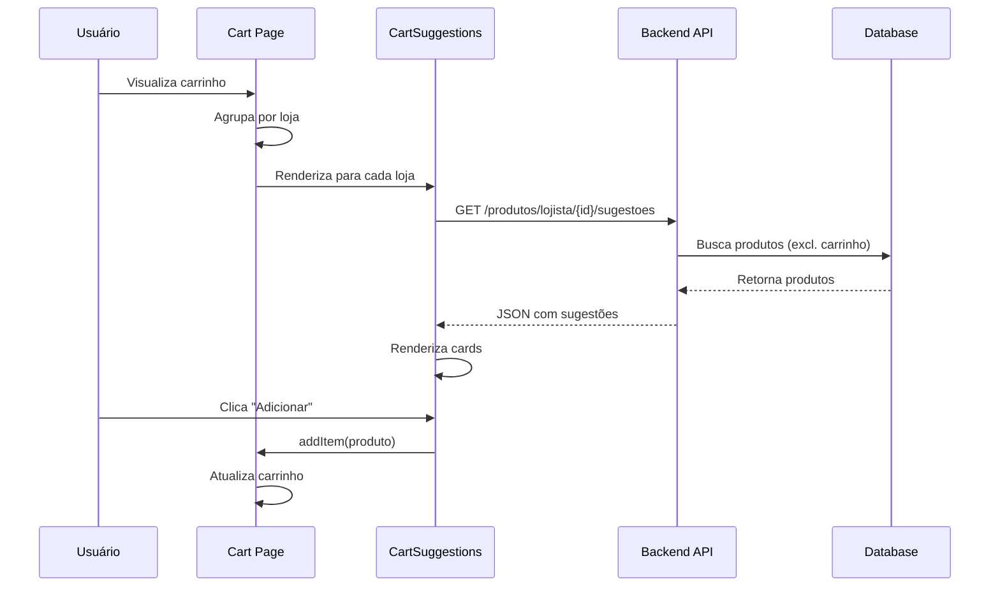

# 🛒 Sistema de Sugestões de Produtos no Carrinho

## 📋 Visão Geral

Implementamos um sistema inteligente de sugestões de produtos da mesma loja durante o processo de compra, exibindo recomendações relevantes na página do carrinho para aumentar o valor médio do pedido.

## ✨ Funcionalidades Implementadas

### Backend (Java/Spring Boot)

#### 1. **Novo Endpoint de Sugestões**
- **Rota:** `GET /api/v1/produtos/lojista/{lojistaId}/sugestoes`
- **Parâmetros:**
  - `lojistaId` - ID do lojista
  - `excluirIds` - Lista de IDs de produtos a excluir (opcional)
  - `limite` - Número máximo de produtos (padrão: 6)

**Exemplo:**
```
GET /api/v1/produtos/lojista/123e4567-e89b-12d3-a456-426614174000/sugestoes?limite=6&excluirIds=prod1&excluirIds=prod2
```

#### 2. **Novos Métodos no Repository**
```java
// ProdutoRepository.java
List<Produto> findByLojistaIdAndAtivoTrueOrderByCriadoEmDesc(UUID lojistaId, Pageable pageable);
List<Produto> findByLojistaIdAndAtivoTrueAndIdNotInOrderByCriadoEmDesc(UUID lojistaId, List<UUID> excluirIds, Pageable pageable);
```

#### 3. **Service com Lógica de Negócio**
```java
// ProdutoService.java
public List<ProdutoSummaryResponseDTO> listarSugestoesDaMesmaLoja(
    UUID lojistaId, 
    List<UUID> excluirIds, 
    int limite
)
```

### Frontend (React/TypeScript)

#### 1. **Componente `CartSuggestions`**
**Localização:** `src/components/CartSuggestions.tsx`

**Props:**
```typescript
interface CartSuggestionsProps {
  lojistaId?: string;        // ID do lojista
  lojistaName: string;       // Nome da loja
  excludeProductIds?: string[]; // IDs para excluir
}
```

**Recursos:**
- ✅ Carregamento assíncrono de sugestões
- ✅ Loading states com skeleton
- ✅ Cards de produtos responsivos
- ✅ Botão "Adicionar ao Carrinho"
- ✅ Badge de desconto
- ✅ Avaliações e reviews
- ✅ Link para ver todos os produtos da loja
- ✅ Tratamento de erros
- ✅ Produtos indisponíveis desabilitados

#### 2. **Atualização do Cart**
**Arquivo:** `src/pages/shared/Cart.tsx`

**Mudanças:**
- Agrupa produtos por loja
- Renderiza sugestões para cada loja
- Integração com CartSuggestions

#### 3. **CartContext Melhorado**
**Arquivo:** `src/contexts/CartContext.tsx`

**Nova Interface:**
```typescript
export interface CartItem {
  id: number | string;
  name: string;
  price: number;
  originalPrice?: number;
  quantity: number;
  image: string;
  store: string;
  lojistaId?: string;  // ✨ NOVO - para sugestões
  inStock: boolean;
}
```

## 🎯 Fluxo de Funcionamento



## 📱 Interface Visual

### Desktop
```
┌─────────────────────────────────────────────────────┐
│ Meu Carrinho (3 itens)                              │
├─────────────────────────────────────────────────────┤
│ [Produto 1 da Loja A]                               │
│ [Produto 2 da Loja A]                               │
│                                                      │
│ ┌───────────────────────────────────────────────┐  │
│ │ Mais produtos de Loja A                       │  │
│ │ [Prod] [Prod] [Prod] [Prod] [Prod] [Prod]   │  │
│ │         Ver todos os produtos →               │  │
│ └───────────────────────────────────────────────┘  │
│                                                      │
│ [Produto 3 da Loja B]                               │
│                                                      │
│ ┌───────────────────────────────────────────────┐  │
│ │ Mais produtos de Loja B                       │  │
│ │ [Prod] [Prod] [Prod] [Prod] [Prod] [Prod]   │  │
│ └───────────────────────────────────────────────┘  │
└─────────────────────────────────────────────────────┘
```

### Mobile
```
┌─────────────────┐
│ Meu Carrinho    │
├─────────────────┤
│ [Produto 1]     │
│ [Produto 2]     │
│                 │
│ Mais de Loja A  │
│ [P] [P]         │
│ [P] [P]         │
│ [P] [P]         │
│                 │
│ Ver todos →     │
└─────────────────┘
```

## 🎨 Cards de Produto

Cada card de sugestão contém:
- 🖼️ Imagem do produto (hover zoom)
- 🏷️ Badge de desconto (se houver)
- 📝 Nome do produto (2 linhas máx)
- ⭐ Avaliação e quantidade de reviews
- 💰 Preço (com preço original riscado se houver)
- ➕ Botão "Adicionar" estilizado
- 🚫 Desabilitado se sem estoque

## 🔧 Como Usar

### Para adicionar sugestões em qualquer página:

```tsx
import { CartSuggestions } from "@/components/CartSuggestions";

function MyPage() {
  return (
    <CartSuggestions
      lojistaId="uuid-da-loja"
      lojistaName="Nome da Loja"
      excludeProductIds={['prod1', 'prod2']} // Opcional
    />
  );
}
```

### Para adicionar lojistaId ao adicionar produto no carrinho:

```tsx
addItem({
  id: product.id,
  name: product.nome,
  price: product.preco,
  image: product.imagemPrincipal,
  store: product.lojista.nomeFantasia,
  lojistaId: product.lojista.id, // ✨ Importante!
  inStock: product.estoque > 0,
});
```

## 📊 Benefícios

### Para o Negócio:
- 📈 **Aumento do ticket médio** - Mais produtos por pedido
- 🛍️ **Cross-selling efetivo** - Produtos relacionados da mesma loja
- 💰 **Maior receita** - Vendas adicionais no momento da compra
- 📦 **Otimização logística** - Produtos da mesma loja = 1 envio

### Para o Usuário:
- 🎯 **Conveniência** - Descobre produtos sem sair do carrinho
- 🚚 **Economia no frete** - Produtos da mesma loja compartilham entrega
- ⚡ **Experiência fluida** - Adiciona produtos com 1 clique
- 💡 **Descoberta** - Conhece mais produtos da loja

### Para o Lojista:
- 📊 **Visibilidade** - Produtos aparecem em momento crítico
- 💼 **Mais vendas** - Exposição adicional no carrinho
- 🤝 **Fidelização** - Cliente conhece mais produtos
- 📈 **ROI** - Sem custo adicional de marketing

## 🚀 Próximas Melhorias

1. **Algoritmo Inteligente**
   - Recomendações baseadas em categoria
   - Produtos frequentemente comprados juntos
   - Machine Learning para personalização

2. **A/B Testing**
   - Testar diferentes layouts
   - Medir impacto no ticket médio
   - Otimizar quantidade de sugestões

3. **Analytics**
   - Taxa de conversão das sugestões
   - Produtos mais clicados
   - Impacto no valor do pedido

4. **Personalização**
   - Histórico de compras
   - Preferências do usuário
   - Filtros por faixa de preço

## 📝 Notas Técnicas

### Performance
- ✅ Carregamento assíncrono (não bloqueia a página)
- ✅ Limite de 6 produtos por padrão
- ✅ Cache no frontend (Context API)
- ✅ Lazy loading de imagens

### SEO
- ✅ Componente não afeta SEO (carregado client-side)
- ✅ Links para produtos têm URLs semânticas
- ✅ Alt text nas imagens

### Acessibilidade
- ✅ ARIA labels adequados
- ✅ Navegação por teclado
- ✅ Contraste adequado
- ✅ Estados disabled visíveis

## 🐛 Troubleshooting

**Problema:** Sugestões não aparecem
- ✅ Verificar se `lojistaId` está definido
- ✅ Confirmar que há produtos ativos na loja
- ✅ Checar console para erros de API

**Problema:** Imagens quebradas
- ✅ Verificar `imagemPrincipal` do produto
- ✅ Fallback para placeholder automático
- ✅ Handler de erro nas tags ``

**Problema:** Produtos do carrinho aparecem nas sugestões
- ✅ Passar `excludeProductIds` corretamente
- ✅ Converter IDs para string se necessário

## 📞 Suporte

Para dúvidas ou problemas:
1. Consultar esta documentação
2. Verificar exemplos no código
3. Checar logs do backend
4. Inspecionar requisições no DevTools

---

**Desenvolvido com ❤️ para WIN Marketplace**
