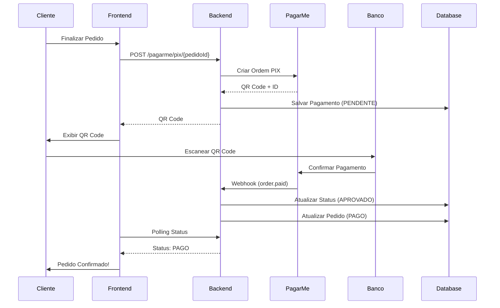

# 💳 Guia de Integração - Pagar.me (Stone)

## 📋 Índice

1. [Visão Geral](#visao-geral)
2. [Configuração](#configuracao)
3. [Endpoints da API](#endpoints-da-api)
4. [Exemplos de Uso](#exemplos-de-uso)
5. [Webhook](#webhook)
6. [Fluxo de Pagamento](#fluxo-de-pagamento)
7. [Tratamento de Erros](#tratamento-de-erros)
8. [Verificação de Status](#verificacao-de-status)

---

## 🎯 Visão Geral

Integração completa com **Pagar.me (Stone)** para processamento de pagamentos PIX no Win Marketplace.

### ✅ Funcionalidades Implementadas

- ✔️ Criação de cobrança PIX
- ✔️ Geração de QR Code
- ✔️ Consulta de ordem
- ✔️ Cancelamento de ordem
- ✔️ Recebimento de webhooks
- ✔️ Atualização automática de status

### 🏗️ Arquitetura

```
PagamentoController → PagamentoService → PagarMeService → API Pagar.me
                           ↓
                    PagamentoRepository (PostgreSQL)
```

---

## 🔧 Configuração

### 1. Variáveis de Ambiente (.env)

```bash
# ========================================
# PAGAR.ME (STONE) - GATEWAY DE PAGAMENTO
# ========================================

# API Key (teste)
PAGARME_API_KEY=acc_z3DoakwS0C5ag84p

# Chave Pública (teste)
PAGARME_PUBLIC_KEY=pk_lKy5xpKjtesp4ZLX

# Ambiente: test (sandbox) | production (produção)
PAGARME_ENVIRONMENT=test

# Habilitar/desabilitar Pagar.me
PAGARME_ENABLED=true
```

### 2. Configuração do Spring (application.yml)

```yaml
pagarme:
  api-key: ${PAGARME_API_KEY}
  public-key: ${PAGARME_PUBLIC_KEY}
  environment: ${PAGARME_ENVIRONMENT:test}
  enabled: ${PAGARME_ENABLED:true}
```

### 3. Obter Credenciais de Produção

1. Acesse o [Dashboard Pagar.me](https://dashboard.pagar.me/)
2. Vá em **Configurações** > **Chaves de API**
3. Copie:
   - **API Key** (secret_key)
   - **Public Key** (public_key)
4. Configure `PAGARME_ENVIRONMENT=production`

---

## 🌐 Endpoints da API

### Base URL

```
http://localhost:8080/api/v1/pagamentos
```

### 1️⃣ Criar Pagamento PIX

Cria uma nova cobrança PIX via Pagar.me.

**Endpoint:**
```http
POST /pagarme/pix/{pedidoId}
Content-Type: application/json
```

**Request:**
```json
{
  "nome": "João Silva",
  "email": "joao@example.com",
  "cpf": "12345678900"
}
```

**Response (200 OK):**
```json
{
  "success": true,
  "message": "Pagamento PIX Pagar.me criado com sucesso!",
  "pedidoId": "abc-123-def-456",
  "billing": {
    "orderId": "or_x7Y8z9",
    "qrCode": "00020126580014br.gov.bcb.pix...",
    "qrCodeUrl": "https://pagar.me/qrcode/...",
    "status": "pending",
    "amount": 5000,
    "expiresAt": "2026-01-14T12:00:00Z",
    "transactionId": "tran_abc123"
  }
}
```

**Erros:**

- **503** - Pagar.me não configurado
  ```json
  {
    "success": false,
    "error": "PAGARME_NAO_CONFIGURADO",
    "message": "Pagar.me não está habilitado..."
  }
  ```

- **400** - Pedido não encontrado
  ```json
  {
    "success": false,
    "error": "ERRO_PROCESSAMENTO",
    "message": "Pedido não encontrado"
  }
  ```

- **500** - Erro interno
  ```json
  {
    "success": false,
    "error": "ERRO_INTERNO",
    "message": "Erro inesperado ao processar PIX: ..."
  }
  ```

---

### 2️⃣ Buscar Ordem

Consulta o status de uma ordem no Pagar.me.

**Endpoint:**
```http
GET /pagarme/ordem/{orderId}
```

**Response (200 OK):**
```json
{
  "success": true,
  "order": {
    "id": "or_x7Y8z9",
    "status": "paid",
    "amount": 5000,
    "currency": "BRL",
    "customer": {
      "name": "João Silva",
      "email": "joao@example.com"
    },
    "charges": [
      {
        "id": "ch_abc123",
        "status": "paid",
        "paid_at": "2026-01-14T10:30:00Z"
      }
    ]
  }
}
```

**Erro (404):**
```json
{
  "success": false,
  "error": "ORDEM_NAO_ENCONTRADA",
  "message": "Ordem não encontrada"
}
```

---

### 3️⃣ Cancelar Ordem

Cancela uma ordem pendente.

**Endpoint:**
```http
DELETE /pagarme/ordem/{orderId}
```

**Response (200 OK):**
```json
{
  "success": true,
  "message": "Ordem cancelada com sucesso",
  "order": {
    "id": "or_x7Y8z9",
    "status": "canceled"
  }
}
```

**Erro (400):**
```json
{
  "success": false,
  "error": "ERRO_CANCELAMENTO",
  "message": "Não é possível cancelar ordem já paga"
}
```

---

### 4️⃣ Webhook do Pagar.me

Recebe notificações de mudança de status.

**Endpoint:**
```http
POST /webhooks/pagarme
Content-Type: application/json
X-Hub-Signature: sha256=...
```

**Request (exemplo):**
```json
{
  "id": "hook_abc123",
  "type": "order.paid",
  "created_at": "2026-01-14T10:30:00Z",
  "data": {
    "id": "or_x7Y8z9",
    "status": "paid",
    "amount": 5000
  }
}
```

**Response (200 OK):**
```json
{
  "status": "success",
  "message": "Webhook processado com sucesso"
}
```

---

## 🧪 Exemplos de Uso

### Exemplo 1: Criar Pagamento PIX com cURL

```bash
curl -X POST http://localhost:8080/api/v1/pagamentos/pagarme/pix/abc-123 \
  -H "Content-Type: application/json" \
  -d '{
    "nome": "João Silva",
    "email": "joao@example.com",
    "cpf": "12345678900"
  }'
```

### Exemplo 2: JavaScript (Frontend)

```javascript
async function criarPagamentoPix(pedidoId, dadosCliente) {
  try {
    const response = await fetch(
      `http://localhost:8080/api/v1/pagamentos/pagarme/pix/${pedidoId}`,
      {
        method: 'POST',
        headers: {
          'Content-Type': 'application/json'
        },
        body: JSON.stringify({
          nome: dadosCliente.nome,
          email: dadosCliente.email,
          cpf: dadosCliente.cpf
        })
      }
    );

    const data = await response.json();

    if (data.success) {
      // Exibir QR Code
      mostrarQRCode(data.billing.qrCodeUrl);
      
      // Copiar código PIX
      const pixCode = data.billing.qrCode;
      
      // Iniciar polling de status
      verificarPagamento(data.billing.orderId);
    } else {
      console.error('Erro:', data.message);
    }
  } catch (error) {
    console.error('Erro na requisição:', error);
  }
}

function mostrarQRCode(qrCodeUrl) {
  // Exibir QR Code na tela
  document.getElementById('qr-code-img').src = qrCodeUrl;
}

async function verificarPagamento(orderId) {
  const interval = setInterval(async () => {
    const response = await fetch(
      `http://localhost:8080/api/v1/pagamentos/pagarme/ordem/${orderId}`
    );
    const data = await response.json();

    if (data.order.status === 'paid') {
      clearInterval(interval);
      alert('Pagamento aprovado!');
      window.location.href = '/pedido-confirmado';
    } else if (data.order.status === 'canceled') {
      clearInterval(interval);
      alert('Pagamento cancelado');
    }
  }, 5000); // Verificar a cada 5 segundos
}
```

### Exemplo 3: Buscar Status da Ordem

```bash
curl http://localhost:8080/api/v1/pagamentos/pagarme/ordem/or_x7Y8z9
```

### Exemplo 4: Cancelar Ordem

```bash
curl -X DELETE http://localhost:8080/api/v1/pagamentos/pagarme/ordem/or_x7Y8z9
```

---

## 🔔 Webhook

### Configurar Webhook no Dashboard Pagar.me

1. Acesse [Dashboard Pagar.me](https://dashboard.pagar.me/)
2. Vá em **Configurações** > **Webhooks**
3. Adicione nova URL:
   ```
   https://seu-dominio.com/api/v1/pagamentos/webhooks/pagarme
   ```
4. Selecione os eventos:
   - `order.created`
   - `order.paid`
   - `order.payment_failed`
   - `order.canceled`

### Eventos Suportados

| Evento | Descrição | Ação no Sistema |
|--------|-----------|-----------------|
| `order.created` | Ordem criada | Log informativo |
| `order.paid` | Pagamento aprovado | Atualizar status → APROVADO |
| `order.payment_failed` | Pagamento falhou | Atualizar status → RECUSADO |
| `order.canceled` | Ordem cancelada | Atualizar status → CANCELADO |

### Validação de Webhook

O Pagar.me envia um header `X-Hub-Signature` com HMAC SHA256:

```java
// TODO: Implementar validação
String signature = request.getHeader("X-Hub-Signature");
pagarMeService.validarWebhook(payload, signature);
```

---

## 🔄 Fluxo de Pagamento



---

## ⚠️ Tratamento de Erros

### Cenários de Erro

1. **Pagar.me não configurado**
   - Verificar variáveis de ambiente
   - Confirmar `PAGARME_ENABLED=true`

2. **Credenciais inválidas**
   - HTTP 401 Unauthorized
   - Verificar API Key no dashboard

3. **Pedido não encontrado**
   - HTTP 404
   - Verificar UUID do pedido

4. **Ordem já paga**
   - Não pode ser cancelada
   - Implementar estorno

5. **Timeout na API**
   - Retry automático (3 tentativas)
   - Fallback para outro gateway

---

## 🔍 Verificação de Status

### Mapeamento de Status

| Status Pagar.me | Status Interno | Descrição |
|-----------------|----------------|-----------|
| `pending` | `PENDENTE` | Aguardando pagamento |
| `paid` | `APROVADO` | Pagamento confirmado |
| `canceled` | `CANCELADO` | Ordem cancelada |
| `failed` | `RECUSADO` | Pagamento falhou |
| `refunded` | `ESTORNADO` | Estorno confirmado |

### Verificar Status no Banco

```sql
SELECT 
  p.id,
  p.transacao_id,
  p.status,
  p.metodo_pagamento,
  p.valor,
  ped.numero_pedido,
  p.created_at
FROM pagamentos p
JOIN pedidos ped ON p.pedido_id = ped.id
WHERE p.metodo_pagamento = 'PIX_PAGARME'
ORDER BY p.created_at DESC;
```

---

## 🧪 Testar Integração

### 1. Iniciar Backend

```bash
cd backend
./mvnw spring-boot:run
```

### 2. Criar Pedido de Teste

```bash
curl -X POST http://localhost:8080/api/v1/pedidos \
  -H "Content-Type: application/json" \
  -d '{
    "lojista_id": 1,
    "usuario_id": 1,
    "itens": [
      {
        "produto_id": 1,
        "quantidade": 1,
        "preco_unitario": 50.00
      }
    ]
  }'
```

### 3. Criar Pagamento PIX

```bash
# Use o pedidoId retornado acima
PEDIDO_ID="abc-123"

curl -X POST http://localhost:8080/api/v1/pagamentos/pagarme/pix/$PEDIDO_ID \
  -H "Content-Type: application/json" \
  -d '{
    "nome": "Teste Silva",
    "email": "teste@example.com",
    "cpf": "12345678900"
  }'
```

### 4. Simular Webhook (Teste)

```bash
curl -X POST http://localhost:8080/api/v1/pagamentos/webhooks/pagarme \
  -H "Content-Type: application/json" \
  -d '{
    "type": "order.paid",
    "data": {
      "id": "or_x7Y8z9",
      "status": "paid"
    }
  }'
```

---

## 📊 Monitoramento

### Logs do Backend

```bash
# Ver logs em tempo real
docker-compose logs -f backend

# Filtrar logs do Pagar.me
docker-compose logs backend | grep "💳 PAGAR.ME"
```

### Métricas Importantes

- Taxa de sucesso de pagamentos
- Tempo médio de confirmação PIX
- Erros de API
- Webhooks recebidos vs processados

---

## 🔐 Segurança

### Recomendações

1. **Nunca exponha a API Key no frontend**
   - Use apenas a Public Key no cliente
   - API Key deve ficar no backend

2. **Valide assinaturas de webhook**
   - Implementar HMAC SHA256
   - Rejeitar webhooks inválidos

3. **Rate Limiting**
   - Limitar requisições por IP
   - Prevenir abuso da API

4. **HTTPS em Produção**
   - Sempre usar SSL/TLS
   - Certificado válido obrigatório

5. **Rotate Credentials**
   - Trocar API Keys periodicamente
   - Usar secrets management (AWS Secrets, Vault)

---

## 📚 Referências

- [Documentação Oficial Pagar.me](https://docs.pagar.me/)
- [API Reference v5](https://docs.pagar.me/reference/vis%C3%A3o-geral-api-1)
- [Dashboard Pagar.me](https://dashboard.pagar.me/)

---

## 🆘 Suporte

### Problemas Comuns

1. **401 Unauthorized**
   - Verificar API Key
   - Confirmar ambiente (test/production)

2. **QR Code não aparece**
   - Verificar resposta da API
   - Checar campo `qr_code_url`

3. **Webhook não recebido**
   - Confirmar URL configurada
   - Verificar firewall/CORS
   - Testar com ngrok em dev

4. **Status não atualiza**
   - Verificar logs de webhook
   - Confirmar processamento
   - Checar mapeamento de status

---

**🎉 Integração Pagar.me Completa e Pronta para Uso!**
